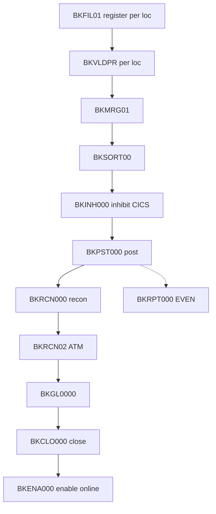

# Job network (lab scheduler view)

```mermaid
flowchart TD
  F[BKFIL01 register per loc] --> V[BKVLDPR per loc]
  V --> M[BKMRG01]
  M --> S[BKSORT00]
  S --> I[BKINH000 inhibit CICS]
  I --> P[BKPST000 post]
  P --> R[BKRCN000 recon]
  R --> A[BKRCN02 ATM]
  A --> G[BKGL0000]
  G --> C[BKCLO000 close]
  C --> E[BKENA000 enable online]
  P -.-> N[BKRPT000 EVEN]
```

Wait: missing location file (RC=8) holds merge/post.
Lock: BKPST000 DISP=OLD HUB.POST.LOCK.
